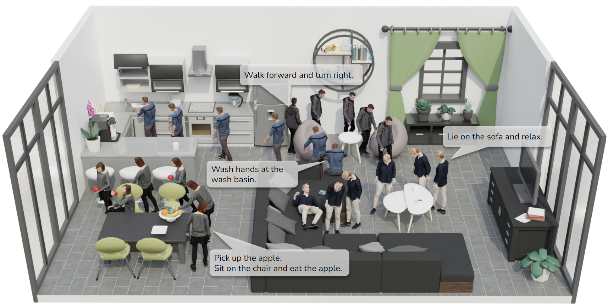

# Autonomous Character-Scene Interaction Synthesis from Text Instruction

<center></center>

#### This is the code repository of **Autonomous Character-Scene Interaction Synthesis from Text Instruction** at **SIGGRAPH Asia 2024** 
#### [arXiv](https://arxiv.org/abs/2410.03187) | [Project Page](https://lingomotions.com/) | [Dataset](https://drive.google.com/file/d/1RadpLt-woPvsIGk9yDW7yX7br3sRO-zi/view?usp=sharing) | [Demo](https://www.youtube.com/watch?v=-Uz6lGLdTy4)


# LINGO Dataset

Please download the LINGO dataset from [Google Drive](https://drive.google.com/drive/folders/1oJ-dnrMahyxoVQxDVAYdPe3MC17kUFAa?usp=sharing). The content inside the download link will be continuously updated to ensure you have access to the most recent data.

Explanation of the files and folders of the LINGO dataset:

- **Scene (folder):** This folder contains the occupancy grid for indoor scenes in LINGO dataset, indicated by each file name. The scenes are mirrored for augmentation.
- **Scene_vis (folder):** This folder contains the occupancy grid for another set of indoor scenes, which we used to test our model and visualize the motions.
- **language_motion_dict (folder):** This folder contains wrapped infomation of each motion segment we used to train our model.
- **human_pose.npy:** This file contains a (N x 63) array, where each row corresponds to the 63-dimensional SMPL-X body_pose parameter of one frame of MoCap data. The data is a concatenation of all motion segments.
- **human_orient.npy:** This file contains a (N x 3) array corresponding to the global_orient parameter of SMPL-X.
- **transl_aligned.npy:** This file contains a (N x 3) array corresponding to the transl parameter of SMPL-X.
- **human_joints_aligned.npy:** This file contains a (N x 28 x 3) array corresponding to the selected joints 3D location (y-up) of SMPL-X.
- **scene_name.pkl:** This file contains a (N, ) list corresponding to the scene name of each frame.
- **start_idx.npy:** This file contains a (M x 3) array corresponding to the start frame index of each motion segment.
- **end_idx.npy:** This file contains a (M x 3) array corresponding to the end frame index of each motion segment.
- **text_aug.pkl:** This file contains a (M, ) list corresponding to the text annotations of each motion segment.
- **left_hand_inter_frame.npy:** This file contains a (M, ) array stores frame IDs where left hand-object contact occurs. And it contains -1 values for motion segments with no left hand-object contact.
- **right_hand_inter_frame.npy:** This file contains a (M, ) array stores frame IDs where right hand-object contact occurs. And it contains -1 values for motion segments with no right hand-object contact.
- **clip_features.npy:** This file contains the preprocessed CLIP features of text annotations in LINGO dataset.
- **text2features_idx.pkl:** This file stores a dictionary that maps text annotations to their corresponding CLIP feature vectors.
- **norm_inter_and_loco__16frames.npy:** This file is a (2, 3) array containing the range of joint coordinates along x, y, and z axes, used for normalizing joint locations.

#### Note: N represents the total number of frames in the LINGO dataset, while M represents the number of motion segments. This dataset is provided in mirrored form.


# Human Motion Synthesis in Indoor Scenes

## Prerequisites

To run the code, you need to have the following installed:

- Python 3.8+
- Required Python packages (specified in `requirements.txt`)

## Installation

1. **Clone the Repository**:
    ```sh
    git clone git@github.com:mileret/lingo-release.git
    ```

2. **Download Checkpoints, Data, and SMPL-X Models**:
    - Download the necessary files and folders from [this link](https://drive.google.com/file/d/1L2V8RlPMAhWF93o_RpIznO_bacjSSLqu/view?usp=drive_link).
    - Extract `lingo_utils.zip`, and place the four files and folders (`dataset`, `ckpts`, `smpl_models`, `vis.blend`) at the root of the project directory.


3. **Install Python Packages**:
    ```sh
    pip install -r requirements.txt
    ```

4. **Install Blender**:
    - We use [Blender](https://www.blender.org/) for visualization of the result.
    - Please download Blender3.6 from its [official website](https://download.blender.org/release/Blender3.6/).
    - (Optional) Then, download [SMPL-X Blender Add-on](https://smpl-x.is.tue.mpg.de/download.php) and activate it in Blender.

## Inference and Visualization

1. **Get Model Input**:

    Open `vis.blend` with [Blender](https://www.blender.org/). Change the `text`, `start_location`, `end_goal` and `hand_goal`. Then run `get_input` in `vis.blend`.

2. **Inference**:

    To synthesis human motions using our model, run

    ```sh
    cd code
    python sample_lingo.py
    ```

3. **Visualization in Blender**:

    Run `vis_output` in `vis.blend`.

    The generated human motion will be displayed in Blender.


# Training
## Overview

This README provides instructions on setting up and training our model using the LINGO dataset.

## Prerequisites

Before you begin, make sure you have the following software installed:

```sh
pip install -r requirements.txt
```

## Model Training

Navigate to the `code` directory:

```bash
cd code
```

To start training the model, run the training script from the command line:

```bash
python train_lingo.py
```

The training script will automatically load the dataset, set up the model, and commence training sessions using the configurations in `./code/config` folder.


# Citation
```
@inproceedings{jiang2024autonomous,
  title={Autonomous character-scene interaction synthesis from text instruction},
  author={Jiang, Nan and He, Zimo and Wang, Zi and Li, Hongjie and Chen, Yixin and Huang, Siyuan and Zhu, Yixin},
  booktitle={SIGGRAPH Asia 2024 Conference Papers},
  pages={1--11},
  year={2024}
}
```
